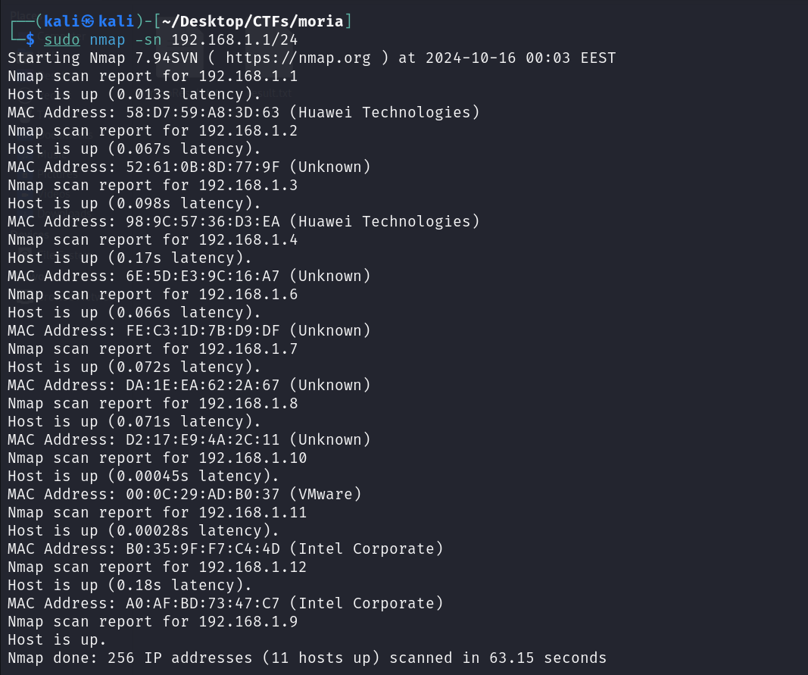
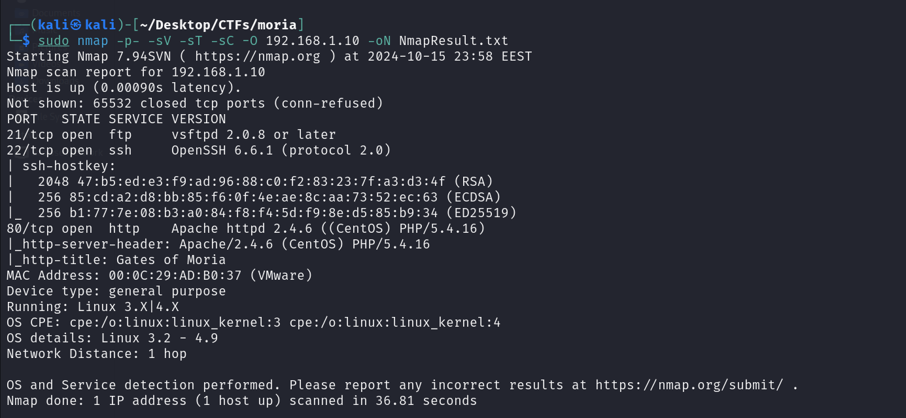
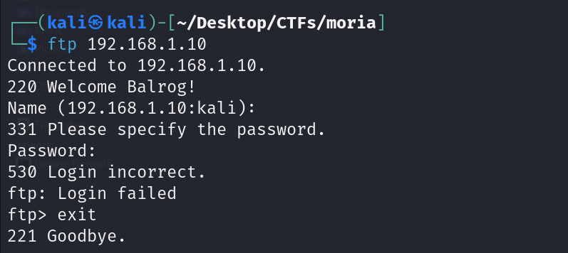
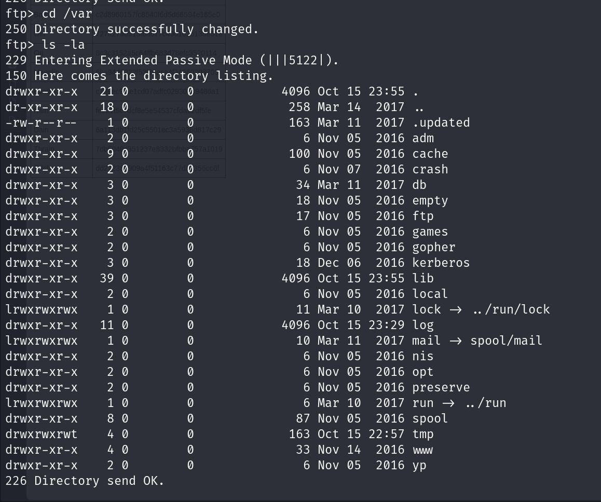
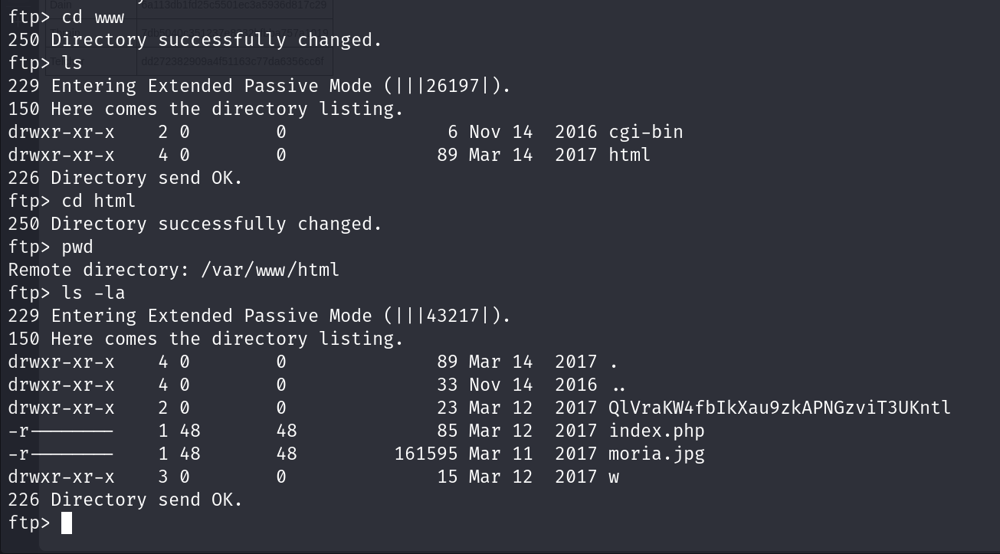
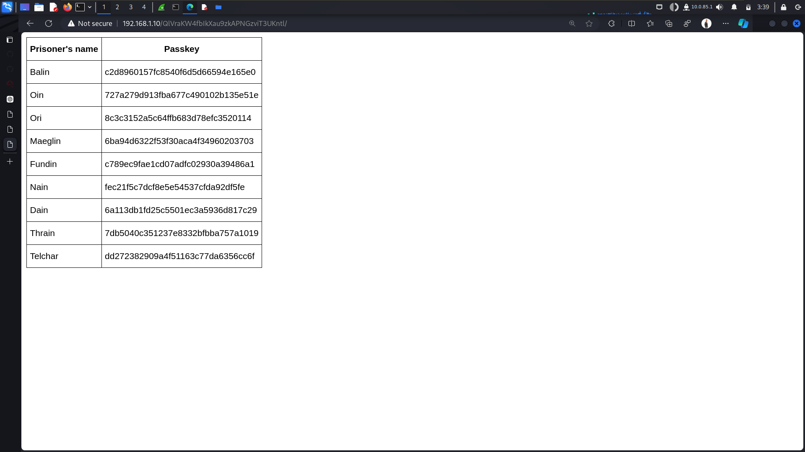
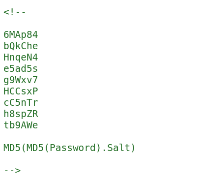
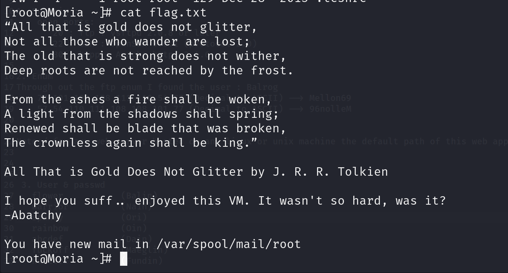
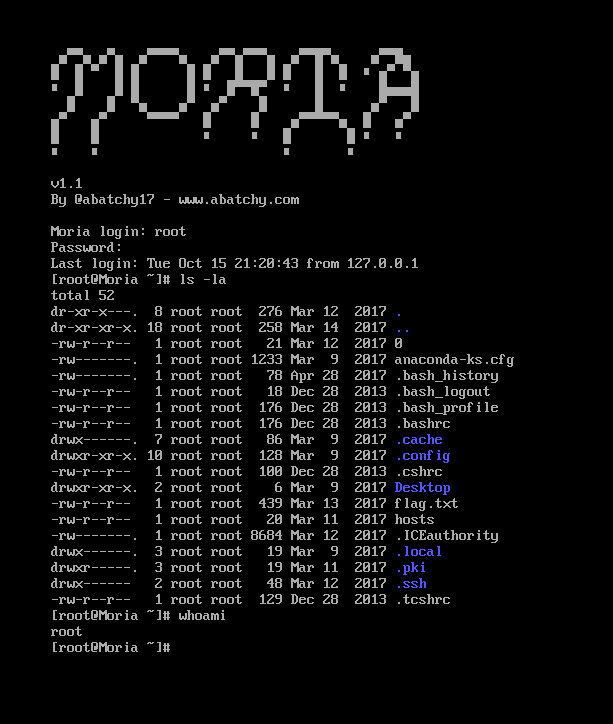

# 🏔️ Moria CTF

```ascii
    /\    /\    /\      Welcome to      /\    /\    /\
   /  \  /  \  /  \     MORIA CTF     /  \  /  \  /  \
  /    \/    \/    \_________________/    \/    \/    \
```

[]()
[]()
[]()

## 📚 Table of Contents
<details>
<summary>Click to expand</summary>

- [Overview](#-overview)
- [Target Information](#-target-information)
- [Phase 1: Reconnaissance](#-phase-1-reconnaissance)
- [Phase 2: Enumeration](#-phase-2-enumeration)
- [Phase 3: Credential Analysis](#-phase-3-credential-analysis)
- [Phase 4: Exploitation](#-phase-4-exploitation)
- [Tools & Techniques](#-tools--techniques)
- [Defense Recommendations](#-defense-recommendations)
- [Conclusion](#-conclusion)
</details>

---

## 🎯 Overview
> "Not all those who wander are lost, but in this CTF, we're definitely looking for vulnerabilities!"

This writeup documents our journey through the Moria CTF challenge, where we'll breach a Linux fortress guarded by ancient dwarven cryptography and modern misconfigurations.

## 🎯 Target Information
```css
⚔️ Target Machine
├── IP Address: 192.168.1.10
└── Platform: Linux/VMware

🛡️ Attack Machine
└── IP Address: 192.168.1.9
```

## 🔍 Phase 1: Reconnaissance

### 🌐 Network Discovery
```bash
# Initial discovery
sudo netdiscover -r 192.168.1.0/24
```

*Finding our target in the digital mines*

### 📡 Port Scanning
```bash
# Comprehensive port scan
nmap -p- -sV -sT -sC -O 192.168.1.10
```



<details>
<summary>🔍 Discovered Services</summary>

```yml
Services:
  - Port 21:
      Protocol: FTP
      Version: vsftpd 2.0.8+
      Status: Open
  
  - Port 22:
      Protocol: SSH
      Version: OpenSSH 6.6.1
      Status: Open
  
  - Port 80:
      Protocol: HTTP
      Version: Apache 2.4.6
      Additional: PHP/5.4.16
      Status: Open
```
</details>

## 🔬 Phase 2: Enumeration

### 🌍 Web Application Analysis

*The legendary Gates of Moria web interface*

### 📂 Directory Enumeration
```bash
gobuster dir -u http://192.168.1.10 -w /usr/share/wordlists/dirbuster/directory-list-2.3-medium.txt
```


### 📁 FTP Investigation


```plaintext
🔍 ASCII Decode:
┌─────────────────────┬─────────────────────┐
│ ASCII               │ Decoded             │
├─────────────────────┼─────────────────────┤
│ 77 101 108...54 57  │ Mellon69           │
│ 57 54 110...101 77  │ 96nolleM           │
└─────────────────────┴─────────────────────┘
```

### 🕵️ Network Analysis




## 🔑 Phase 3: Credential Analysis

### 🗝️ Discovered Hashes


<details>
<summary>📜 Full Hash List</summary>

```yml
Credential Pairs (Hash$Salt):
  Balin   : c2d8960157fc8540f6d5d66594e165e0$6MAp84
  Oin     : 727a279d913fba677c490102b135e51e$bQkChe
  Ori     : 8c3c3152a5c64ffb683d78efc3520114$HnqeN4
  Maeglin : 6ba94d6322f53f30aca4f34960203703$e5ad5s
  Fundin  : c789ec9fae1cd07adfc02930a39486a1$g9Wxv7
  Nain    : fec21f5c7dcf8e5e54537cfda92df5fe$HCCsxP
  Dain    : 6a113db1fd25c5501ec3a5936d817c29$cC5nTr
  Telchar : dd272382909a4f51163c77da6356cc6f$h8spZR
  Thrain  : 7db5040c351237e8332bfbba757a1019$tb9AWe
  Balrog  : Mellon69 (plaintext)
```
</details>

### 🔐 Hash Analysis


```javascript
/**
 * Password Hashing Schema
 * ----------------------
 * Format: MD5(MD5(Password).Salt)
 * Salt Length: 6 characters
 */
```

<details>
<summary>🔍 Hash Structure Details</summary>

```mermaid
graph TD
    A[Password] -->|First MD5| B[MD5 Hash]
    B -->|Concatenate| C[Hash + Salt]
    C -->|Second MD5| D[Final Hash]
```
</details>

### 🛠️ Password Cracking


<details>
<summary>🗝️ Cracked Passwords</summary>

```css
Successful Cracks:
├── Balin   ➔ flower
├── Nain    ➔ warrior
├── Ori     ➔ spanky
├── Oin     ➔ rainbow
├── Dain    ➔ abcdef
├── Maeglin ➔ fuckoff
└── Fundin  ➔ hunter2
```
</details>

## 💥 Phase 4: Exploitation

### 🚪 Initial Access


### ⚡ Privilege Escalation



### 🔐 Persistence


### 🏆 Victory


## 🛠️ Tools & Techniques

```mermaid
mindmap
  root((CTF Tools))
    Reconnaissance
      netdiscover
      Nmap
      Wireshark
    Enumeration
      Gobuster
      FTP Client
      Web Tools
    Exploitation
      SSH Client
      Hashcat
      Privilege Escalation Scripts
```

## 🛡️ Defense Recommendations

<details>
<summary>📋 Security Checklist</summary>

```markdown
1. 🔒 Service Security
   - [ ] Update all services
   - [ ] Replace FTP with SFTP
   - [ ] Implement regular patching

2. 🔑 Authentication
   - [ ] Replace MD5 with Argon2/bcrypt
   - [ ] Enforce strong passwords
   - [ ] Enable 2FA where possible

3. 🚫 Access Control
   - [ ] Implement least privilege
   - [ ] Segregate user access
   - [ ] Regular access audits

4. 📡 Monitoring
   - [ ] Set up IDS/IPS
   - [ ] Enable comprehensive logging
   - [ ] Regular security assessments
```
</details>

## 🏁 Conclusion
> "Even the smallest vulnerability can bring down the greatest of defenses"

✨ **Key Takeaways:**
- Thorough enumeration is crucial
- Understanding hash formats enables effective cracking
- Proper documentation saves lives (and time)

---

<div align="center">

```ascii
   /\                      Mission                    /\
  /  \                   Accomplished                /  \
 /    \                    👑 👑 👑                 /    \
```

*Created with 🖤 by SecurityResearcher*
*For educational purposes only*

</div>
