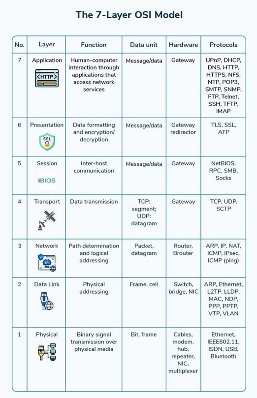
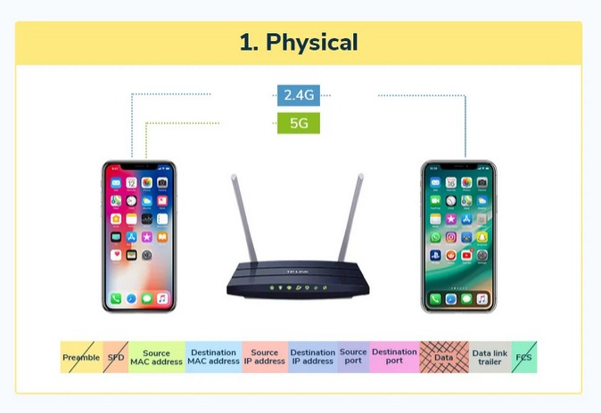
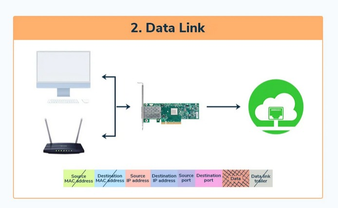
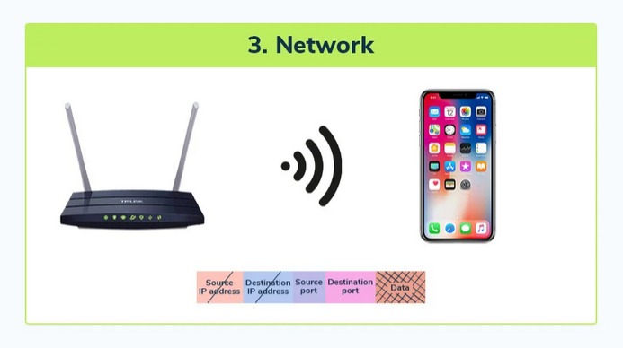
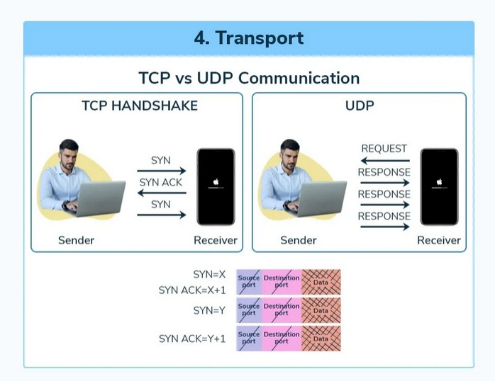
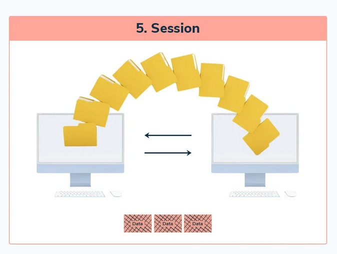
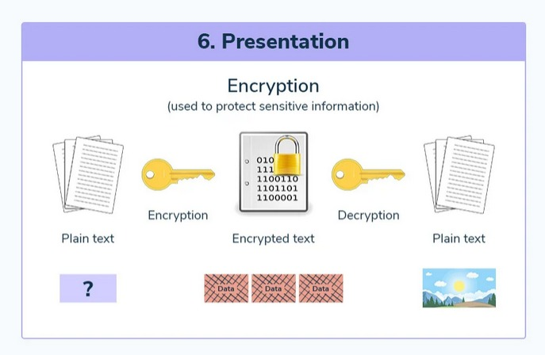
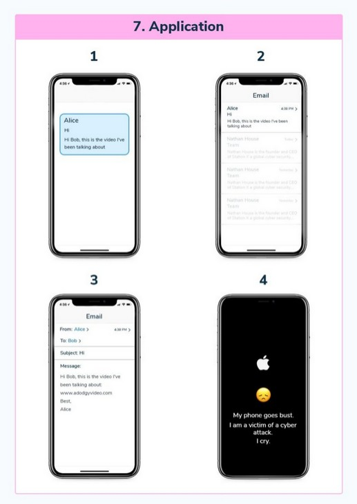

# OSI Reference Model

The **Open Systems Interconnection (OSI)** model is a conceptual framework that standardizes the functions of a communication system into seven layers. These layers define how data is transmitted and received over a network.

## Layers of the OSI Model

The OSI model consists of **7 layers**:

1. **Physical Layer**
2. **Data Link Layer**
3. **Network Layer**
4. **Transport Layer**
5. **Session Layer**
6. **Presentation Layer**
7. **Application Layer**



```
Each layer is responsible for specific functions and passes data between itself and adjacent layers. This model helps network professionals troubleshoot problems by isolating issues layer by layer.
```
---

## Layer 1: Physical Layer

- **Function:** Transmits raw bits over a physical medium, such as cables or wireless signals.
- **Examples:** Ethernet cables, Wi-Fi signals.
- **Devices:** Hubs, repeaters, cables.
- **Data Transferred:** **Bits**



```
_This layer deals with the physical transmission of data, such as using Ethernet cables or Wi-Fi signals._
```
---

## Layer 2: Data Link Layer

- **Function:** Ensures error-free transfer of data between devices on the same network, using MAC addresses.
- **Examples:** NICs (Network Interface Cards), switches.
- **Devices:** Switches, NICs, MAC addresses.
- **Data Transferred:** **Frames**


```
_The Data Link Layer ensures reliable data transfer within the same network using MAC addresses._
```
---

## Layer 3: Network Layer

- **Function:** Handles routing of data across networks using logical addresses like IP addresses.
- **Examples:** Routers, IP addresses, NAT, ARP.
- **Devices:** Routers.
- **Data Transferred:** **Packets**


```
_The Network Layer uses IP addresses to route data packets across different networks._
```
---

## Layer 4: Transport Layer

- **Function:** Ensures end-to-end communication by segmenting data and providing flow control. It uses protocols like TCP and UDP.
- **Examples:** TCP, UDP.
- **Devices:** Firewalls, routers.
- **Data Transferred:** **Segments**


```
_The Transport Layer manages data segments and ensures reliable communication through protocols like TCP and UDP._
```
---

## Layer 5: Session Layer

- **Function:** Manages sessions between applications, ensuring data flows uninterrupted and correctly sequenced.
- **Examples:** Session ID, port numbers, session management.
- **Devices:** Firewalls.
- **Data Transferred:** **Session data**


```
_The Session Layer ensures proper management of communication sessions between devices._
```
---

## Layer 6: Presentation Layer

- **Function:** Ensures data is in a format the receiving application can understand, including encryption and compression.
- **Examples:** SSL/TLS, data encryption.
- **Devices:** None specific.
- **Data Transferred:** **Data formats (encrypted, compressed)**


```
_The Presentation Layer handles encryption and compression, ensuring secure data transfer._
```
---

## Layer 7: Application Layer

- **Function:** The interface for end-users, where network services and applications interact.
- **Examples:** Web browsers, email clients, APIs.
- **Devices:** PCs, Firewalls, IDS.
- **Data Transferred:** **User data**


```
_The Application Layer is where users interact with network services like web browsers and email clients._
```
---

## OSI Model Layers Overview

| **Layer** | **Name**            | **Function**                                                                                          | **Protocols/Devices**                                         |
|-----------|---------------------|------------------------------------------------------------------------------------------------------|--------------------------------------------------------------|
| **Layer 1** | **Physical**        | Handles the physical transmission of data over a medium.                                              | Ethernet, Wi-Fi, Cables, Hubs, Repeaters                      |
| **Layer 2** | **Data Link**       | Ensures data transfer is error-free between two directly connected nodes, using MAC addresses.       | NIC, Switches, Ethernet, Frame Relay                         |
| **Layer 3** | **Network**         | Routes data packets using IP addresses across networks.                                               | Routers, IP, ARP, NAT, OSPF, IPv4/IPv6                       |
| **Layer 4** | **Transport**       | Manages end-to-end communication, splitting and reassembling data for reliable delivery.             | TCP, UDP, Segments                                            |
| **Layer 5** | **Session**         | Manages sessions and keeps them open or closed between applications.                                 | TCP, UDP, Port Numbers, Session Management                    |
| **Layer 6** | **Presentation**    | Ensures data is in a readable format and handles encryption and compression.                          | SSL/TLS, POP3S, IMAPS, File Compression                       |
| **Layer 7** | **Application**     | Provides the user interface and access to network services.                                          | HTTP, DNS, FTP, Email Clients, APIs                           |

---

## Key Concepts

- **Encapsulation:** Adding headers to data at each layer as it is transmitted.
- **De-encapsulation:** Removing headers at each layer as data is received.

---

### **Summary of the OSI Model**

The **OSI Model** provides a clear framework for understanding how data travels from one device to another, passing through seven layers, each responsible for a specific task. While the OSI model is not directly implemented in real-world networks, it helps engineers and IT professionals troubleshoot network issues by identifying the problematic layer.

